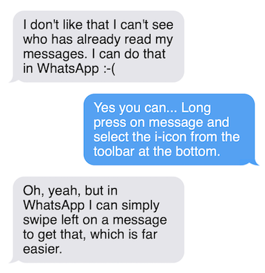
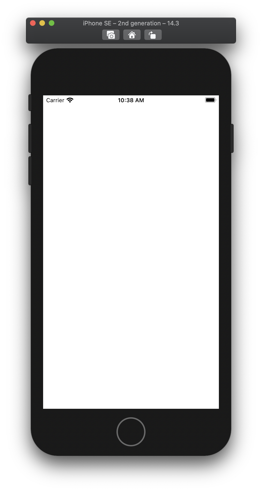
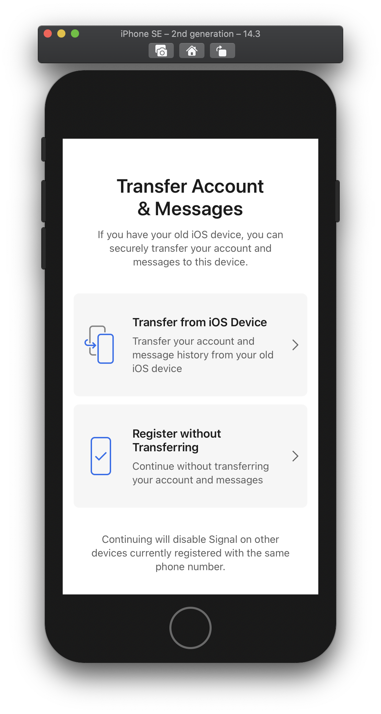
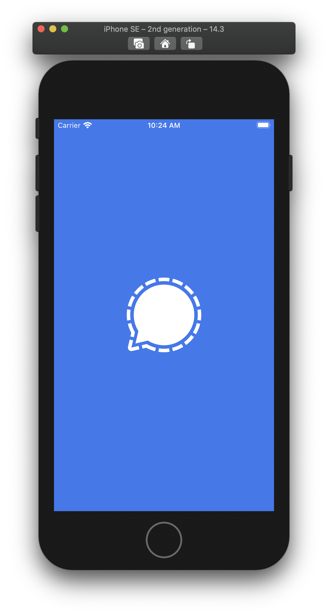
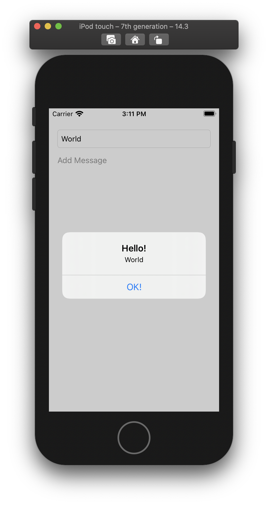

# Signal Feature Diary

> A diary of building a feature for the Signal private messenger

## TL;DR

Mid January 2021, there was a worldwide moment where many tech savvy and people alike pushed their friends to move away from WhatsApp and adopt the [Signal](https://github.com/signalapp/Signal-iOS) private messenger as a privacy-secure alternative. This resulted in millions of people registering and simply overwhelming the team behind it.

<p align="center">  
  
</p>

<p align="center">  
  
</p>
 
<p align="center">  
  
</p>
 
I had also contributed (a little) to this tsunami, by urging my friends on WhapsApp to leave the app for the better and more privacy-secure [Signal](https://github.com/signalapp/Signal-iOS) app. The effect was bit of a downer, since most of them came back to me with feedback along the lines of "it doesn't work". Luckily I could keep most of them interested and when things cleared up, I was happy to see most of them on [Signal](https://github.com/signalapp/Signal-iOS), even cheering for the recovery by the team behind it.

At the same time, I also got other feedback: "Hey, I thought this was as good as WhatsApp, but I can't do <UI feature X>". At that point I decided to not simply submit a feature request, but to rise to the occasion and embark on a mission to implement it myself and submit it. [Signal](https://github.com/signalapp/Signal-iOS) is afterall Open Source software, so if I support, I should put my foot where my mouth is.

This repository is first of all a diary of this journey, starting from litterally nothing, with just a feature request from one of my friends and [a tiny bit of experience with Swift](https://github.com/christophevg/mastermind).

Before I actually dive into the [Signal](https://github.com/signalapp/Signal-iOS) code base, I'll be prototyping a focused version of what I want to add in this repository, which therefore also serves as a kind of Hello World app, again starting from no real iOS app development experience to something that implements the feature I want to add.

As I'm writing this I just as intrigued to see where this will end ... hopefully in a new feature in the [Signal](https://github.com/signalapp/Signal-iOS) app ;-)

## Day 0 - The Calling

One of my first conversations on Signal went along the lines of ...  

<p align="center">

</p>

She had a point, and I had a mission.

My initial plan of action is to learn to build an iOS app using Swift by implementing a minimal app that mimics the existing conversation support, including the existing swipe right to reply, in a way that it is representative for the way it is currently implemented in the Signal app.

Next I'll be adding the swipe left to reveal the information panel, with as little as changes possible, adding as little code as possible, hopefully breaking as little as possible ;-)

That along with this diary of every step I take is what this repository is all about. 

> **Public Service Announcement** Although the granularity of entries in this diary is "days", you should mentally map that to "an occasional hour". Each entry represents a moment I find time to try and make some progress, which is hardly daily and hardly a day.

## Day 1 - First (Xcode) Pains

And it all starts with [Start Developing iOS Apps (Swift)](https://developer.apple.com/library/archive/referencelibrary/GettingStarted/DevelopiOSAppsSwift/)

> Well, actually it started with a Google search for "building ios app with swift", which turned up that (archived) page on the developer site of Apple ;-)

Okay, that should provide me with a guide tour into the Xcode-based Swift development world of iOS apps. While following these steps, I'm going to project my newfound knowledge onto [Signal](https://github.com/signalapp/Signal-iOS), trying to find entry points into understanding the codebase, because at first sight, I couldn't easily find what I was hoping/expecting to find ;-)


Start Xcode, create new app project and run! Nice, a brand new blank iOS app is born. Lets try to run Signal: Open workspace, run ... compilation errors! At first sight it looks like Swift syntax issues. Since I don't expect the Signal developers to commit code with syntactical issues, and knowing that Swift grows at a lightning fast speedl introducing breaking syntax novelties, I suspeted my Xcode 11.2 not being up to date anymore. 

The [building instructions](https://github.com/signalapp/Signal-iOS/blob/master/BUILDING.md#building) are pretty clear on this: 

> "We typically develop against the latest stable version of Xcode."

So, time to upgrade to Xcode 12.3, a download of ±12GB, which apparently requires 40GB of free disk space. The only was to fulfill this requirement was to simply delete my existing Xcode installation entirely. A few hours later the first speedbump was overcome.



Building Signal now succeeded and I'm awaiting the simulator to show up, and waiting,... Somehow Xcode thinks it running, but nothing is showing, not even an empty simulator window. After googling a bit, a  [StackOverflow article](https://stackoverflow.com/questions/29296360/ios-simulator-is-not-launching) brings a solution. Apparently, the simulator processes were still running from before the Xcode upgrade. So after killing them all and restarting the build... Behold: Signal boots in the simulator. Cool 🤓 Second speedbump cleared.

And it becomes even more cool as you can actually run it as if it was run on a real phone. So, let's try registering... Everything goes smooth, I get a code on my phone, can enter it, but then... I can't use my phone number on two Signal installs, which is not that unlogical. Hm, how to solve that one? That speedbump will have to be resolved soon. But for now, I have a running development version of Signal, I have a blank app running. Time to dive into the "Hello World" world.

## Day 2 - Hello (iOS/Swift/Xcode) World

So, I'm following the lessons/sections of [Start Developing iOS Apps (Swift)](https://developer.apple.com/library/archive/referencelibrary/GettingStarted/DevelopiOSAppsSwift/). Now, my end result won't be a food tracking thingy, it will be a conversation thingy, which evolves from a typical [Hello World](https://en.wikipedia.org/wiki/%22Hello,_World!%22_program) into something that allows me to create text balloons and swipe them right to reply and left to show an info pane.

But first ... [Hello World](https://en.wikipedia.org/wiki/%22Hello,_World!%22_program)

Now, I'm not going to repeat everything that is to be read in the [Start Developing iOS Apps (Swift)](https://developer.apple.com/library/archive/referencelibrary/GettingStarted/DevelopiOSAppsSwift/) here. I will add my _very_ personal opinion and point out the things where I deviate, trying to discover things _my_ way ;-)

So after struggling a bit with finding my way on Xcode - yes I still am not convinced of a mandatory use of an IDE, and would rather prefer to edit code in my perferrred text/code editor - I got to the point where I needed what I still believe to be the most important function of a language: showing a message box / pop up dialog. So in stead of displaying text in a label, I looked up how to display a message box, which I would expect to adhere to a signature like `alert(message : string)`. Behold the iOS/Swift equivalent:

```swift
private func alert(_ message: String) {
  let alert = UIAlertController(
    title: "Hello!",
    message: message,
    preferredStyle: UIAlertController.Style.alert
  )
  let alertAction = UIAlertAction(
    title: "OK!",
    style: UIAlertAction.Style.default
  ) {
    (UIAlertAction) -> Void in
  }
  alert.addAction(alertAction)
  present(alert, animated: true) {
    () -> Void in
  }
}
```

This hidious piece of code really makes me vomit. Especially because I can't seem to trim it down to something reasonable:

* `preferredStyle: UIAlertController.Style.alert` and `style: ...Style.default` can't be omitted ... WHY? There clearly `default` values.
* At first I thought that the two anonymous code blocks also would be required. While writing this fist rant, I tried and discovered they could be removed without any (for now apprant) implications.

So I could at least trim it to:

```swift
private func alert(_ message: String) {
  let alert = UIAlertController(
    title: "Hello!",
    message: message,
    preferredStyle: UIAlertController.Style.alert
  )
  let alertAction = UIAlertAction(
    title: "OK!",
    style: UIAlertAction.Style.default
  )
  alert.addAction(alertAction)
  present(alert, animated: true)
}
```

So I ended up with my first storyboard and view controller:

```swift
//
//  ViewController.swift
//  Conversator
//
//  Created by Christophe VG on 23/01/2021.
//

import UIKit

class ViewController: UIViewController, UITextFieldDelegate {

  //MARK: properties

  @IBOutlet weak var newMessage: UITextField!

  override func viewDidLoad() {
    super.viewDidLoad()
    newMessage.delegate = self
  }

  //MARK: actions

  @IBAction func addMessage(_ sender: Any) {
    self.alert(newMessage.text!)
  }

  //MARK: UITextFieldDelegate

  func textFieldShouldReturn(_ textField: UITextField) -> Bool {
    newMessage.resignFirstResponder()
    return true
  }

  func textFieldDidEndEditing(_ textField: UITextField) {
    self.alert(textField.text!)
  }

  private func alert(_ message: String) {
    let alert = UIAlertController(
      title: "Hello!",
      message: message,
      preferredStyle: UIAlertController.Style.alert
    )
    let alertAction = UIAlertAction(
      title: "OK!",
      style: UIAlertAction.Style.default
    )
    alert.addAction(alertAction)
    present(alert, animated: true)
  }
}
```

And my version of an iOS Swift-based Hello World app..

<p align="center">  
  
</p>
