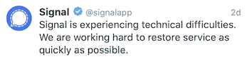
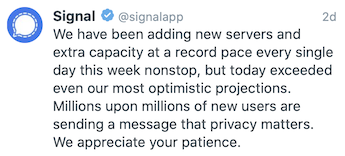
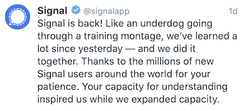

# Signal Feature Diary

> A diary of building a feature for the Signal private messenger

## TL;DR

Mid January 2021, there was a worldwide moment where many tech savvy and people alike pushed their friends to move away from WhatsApp and adopt the [Signal](https://github.com/signalapp/Signal-iOS) private messenger as a privacy-secure alternative. This resulted in millions of people registering and simply overwhelming the team behind it.

  
  

  
  

 

  
  

 
I had also contributed (a little) to this tsunami, by urging my friends on WhapsApp to leave the app for the better and more privacy-secure [Signal](https://github.com/signalapp/Signal-iOS) app. The effect was bit of a downer, since most of them came back to me with feedback along the lines of "it doesn't work". Luckily I could keep most of them interested and when things cleared up, I was happy to see most of them on [Signal](https://github.com/signalapp/Signal-iOS), even cheering for the recovery by the team behind it.

At the same time, I also got other feedback: "Hey, I thought this was as good as WhatsApp, but I can't do <UI feature X>". At that point I decided to not simply submit a feature request, but to rise to the occasion and embark on a mission to implement it myself and submit it. [Signal](https://github.com/signalapp/Signal-iOS) is afterall Open Source software, so if I support, I should put my foot where my mouth is.

This repository is first of all a diary of this journey, starting from litterally nothing, with just a feature request from one of my friends and [a tiny bit of experience with Swift](https://github.com/christophevg/mastermind).

Before I actually dive into the [Signal](https://github.com/signalapp/Signal-iOS) code base, I'll be prototyping a focused version of what I want to add in this repository, which therefore also serves as a kind of Hello World app, again starting from no real iOS app development experience to something that implements the feature I want to add.

As I'm writing this I just as intrigued to see where this will end ... hopefully in a new feature in the [Signal](https://github.com/signalapp/Signal-iOS) app ;-)

## Day 0

On of my first conversations on Signal went along the lines of ...

"I don't like that I can't see who has already read my messages. I can do that in WhatsApp :-("

"Yes you can... Long press on message and select the i-icon from the toolbar at the bottom."

"Oh, yeah, but in WhatsApp I can simply swipe left on a message to get that, which is far easier."

She had a point, and I had a mission.

